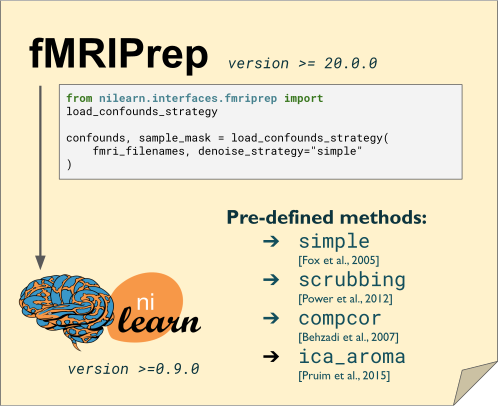

# Summary

Reducing contributions from non-neuronal sources is a crucial step in functional magnetic resonance imaging (fMRI) connectivity analyses.
Many viable strategies for denoising fMRI are used in the literature, 
and practitioners rely on denoising benchmarks for guidance in the selection of an appropriate choice for their study.
However, fMRI denoising software is an ever-evolving field, and the benchmarks can quickly become obsolete as the techniques or implementations change.
In this work, we present a fully reproducible denoising benchmark featuring a range of denoising strategies and evaluation metrics for connectivity analyses,
built primarily on the fMRIPrep [@fmriprep1] and Nilearn [@nilearn] software packages.
We apply this reproducible benchmark to investigate the robustness of the conclusions across two different datasets and two versions of fMRIPrep.
The majority of benchmark results were consistent with prior literature.
Scrubbing, a technique which excludes time points with excessive motion,
combined with global signal regression, is generally effective at noise removal.
Scrubbing however disrupts the continuous sampling of brain images and is incompatible with some statistical analyses,
e.g. auto-regressive modeling. In this case, a simple strategy using motion parameters,
average activity in select brain compartments, and global signal regression should be preferred.
Importantly, we found that certain denoising strategies behave inconsistently across datasets and/or versions of fMRIPrep,
or had a different behavior than in previously published benchmarks.
These results demonstrate that a reproducible denoising benchmark can effectively assess the robustness of conclusions across multiple datasets and software versions.
In addition to reproducing core computations, interested readers can also reproduce or modify the figures of the article using the Jupyter Book project [@jupyter] and the Neurolibre [@neurolibre] reproducible preprint server.
With the denoising benchmark, we hope to provide useful guidelines for the community, 
and that our software infrastructure will facilitate continued development as the state-of-the-art advances. 

# Acknowledgements

The initial API was started by Hanad Sharmarke and Pierre Bellec. 
The implementation was completed by Hao-Ting Wang, Steven Meisler, François Paugam, and Pierre Bellec. 
Hao-Ting Wang migrated the code base to Nilearn. 
Nicolas Gensollen and Bertrand Thirion reviewed the code migrated to Nilearn. 
We thank Chris Markiewicz for feedback related to fMRIPrep.

Hao-Ting Wang and Pierre Bellec drafted the initial version of the paper, with critical feedback from Natasha Clarke. 

Please see the original repository for a history of initial development and [contributors](https://github.com/SIMEXP/load_confounds#contributors-), 
and this [issue](https://github.com/nilearn/nilearn/issues/2777 ) for a history of the integration in Nilearn and all the linked Pull Requests.

The project is funded by IVADO PRF3, CCNA and Courtois Foundation, the neuromind collaboration. 
HTW and NC funded by Institut de valorisation des données (IVADO) postdoctoral research funding. 
SLM was funded by the National Institute on Deafness and Other Communication Disorders (NIDCD; Grant 5T32DC000038). 
CJM funded by NIMH 5R24MH117179. 
FP funded by Courtois Neuromod. 
PB funded by Fonds de Recherche du Québec - Santé (FRQ-S). 

# References